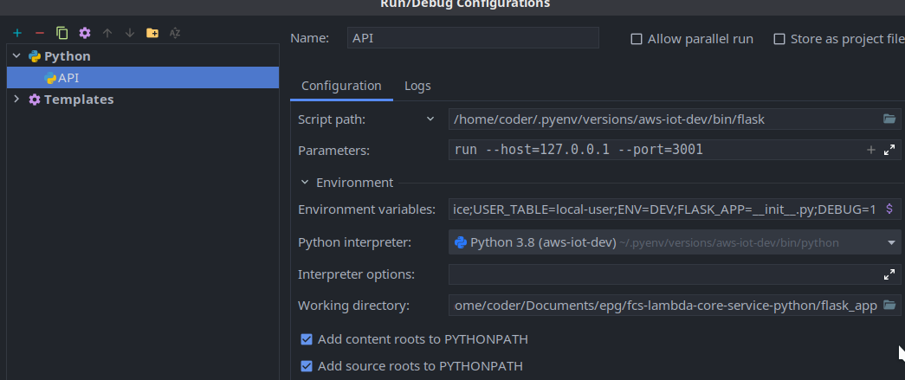

# Development Guide

## How to run on local
- The idea is to set up schema for dynamodb on local
- Then we will populate some data to this dynamodb
- Then we will run our test set on these mock data
- When everything will be set and done, you should only run a few command in order to set up the dev process

- Set up all the containers for development
```bash
make local
```

- Set up the local development process on local using venv
```bash
make setup
```

- Seed the database
```bash
make seed
```

- After that we can develop/test the api just as a usual flask app

### Debug with Flask
- Behind the scenes, `serverless-wsgi` use Werkzeug to run server.
- Idea: You would want to call `flask` to run something for you
- Where
  - flask: is the package that you install with pip
  - something: The app you created in code with syntax like
  ```python
  from flask import Flask
  app = Flask(__name__)
  ```

### Debug Flask with Pycharm
- The config to debug flask should look like the following image, although you might want to twist something to match your style

- Here is some explanations:
  - Python interpreter: Path to Python you would want to use for debugging.
  - Script path: This is the path that point to `flask` in your environment. In the above image, the `flask` is in an environment name `aws-iot-dev`, which is managed by `pyenv`.
  - In the case set up scripts with venv will be added in the future, this script path should be in `${PWD}/.venv/bin/flask` and `${PWD}/.venv/bin/python`

  - Parameters: We would want to call `flask run` with host and port
  - Environment variables: Here is the list of full environment variables used in the above image

  ```.env
  FLASK_APP=__init__.py
  DEBUG=1
  PYTHONUNBUFFERED=1
  AWS_ACCESS_KEY=123
  AWS_SECRET_KEY=12345678
  REGION=us-east-1
  OTP_SECRECT=123
  OTP_EXPIRED_LIMIT=10PARKING_SESSION_TABLE=local-parking-session
  PARKING_INFO_TABLE=local-parking-info
  PARKING_INFO_TABLE_INDEX=local-park-index
  PARKING_DEVICE_TABLE=local-parking-device
  USER_TABLE=local-user
  ENV=DEV
  ```

  - Where the `FLASK_APP` environment needs to point to the file that expose app (in this case `__init__.py`) at `flask_app/__init__.py`
  - The working directory and `FLASK_APP` is related. 
    - If working directory is pointing to `flask_app` already, the `FLASK_APP` is `__init__.py`
    - If working directory is pointing to root folder, the `FLASK_APP` is `flask_app/__init__.py`

### Debug Flask with VSCode
- In visual code, to debug flask app, you need 2 files in `.vscode/` folder

```bash
.vscode
├── launch.json
└── settings.json
```

- `settings.json` will contain the information for Python interpreter. You could generate this file directly using the following steps:
  - `Ctrl` + `Shift` + `p` to open VSCode Command Palette
  - Search for `Python: Select Interpreter`
  - Choose the environment you would want to use for debug
  - An example `settings.json`
    ```json
    {
        "python.pythonPath": "/home/coder/.pyenv/versions/3.8.4/envs/aws-iot-dev/bin/python"
    }
    ```
- `launch.json` will contain the information for flask app. Basically it uses the same rules as explained above.
- Here is an example `launch.json`

  ```json
  {
    // Use IntelliSense to learn about possible attributes.
    // Hover to view descriptions of existing attributes.
    // For more information, visit: https://go.microsoft.com/fwlink/?linkid=830387
    "version": "0.2.0",
    "configurations": [
        {
            "name": "Python: Flask",
            "type": "python",
            "request": "launch",
            "module": "flask",
            "env": {
                "FLASK_APP": "flask_app/__init__.py",
                "FLASK_ENV": "development",
                "PYTHONUNBUFFERED": "1",
                "AWS_ACCESS_KEY": "123",
                "AWS_SECRET_KEY": "12345678",
                "REGION": "us-east-1",
                "OTP_SECRECT": "123",
                "OTP_EXPIRED_LIMIT": "10",
                "PARKING_SESSION_TABLE": "local-parking-session",
                "PARKING_INFO_TABLE": "local-parking-info",
                "PARKING_INFO_TABLE_INDEX": "local-park-index",
                "PARKING_DEVICE_TABLE": "local-parking-device",
                "USER_TABLE": "local-user",
                "ENV": "DEV",
                "DEBUG": "1",
            },
            "args": [
                "run",
                "--no-debugger",
                "--host=127.0.0.1",
                "--port=3001"
            ],
            "jinja": true
        }
    ]
  }
  ```
  - You can init this format using Vscode Python plugin following [this tutorial](https://code.visualstudio.com/docs/python/debugging)

## How to debug in container

- Basically debug in Python happen like this:
  - Python program is executed
  - IDE will interrupt the signal provided to/from the program by attaching to the process spawned by the program
  - Using this approach, actually we can expose the debugger at some port from the container to the host (where we have IDEs) and debug using those IDEs. We can debug using Pycharm/Vscode or any IDE
  - Usually IDEs will try to hide these process under a nice abstract
    - This is a [Jetbrain's guide](https://blog.jetbrains.com/pycharm/2017/03/docker-compose-getting-flask-up-and-running/) to debug inside container using Pycharm
    - This is a [Microsoft guide](https://code.visualstudio.com/docs/containers/debug-python) to debug inside container using VSCode

- Here is a simpler version on how to debug a Flask app in container
  - You need to install this extension: [Remote Containers](https://marketplace.visualstudio.com/items?itemName=ms-vscode-remote.remote-containers) by go to VSCode Plugins and install it.
  - You need a "idle" environment. As here you can see in the Develop.Dockerfile

  ```Dockerfile
  FROM nikolaik/python-nodejs:python3.8-nodejs14

  WORKDIR /app

  # ENV PATH /app/node_modules/.bin:$PATH

  COPY package.json /app/package.json
  RUN npm i && npm i -g serverless@2.35.0

  COPY requirements.txt /tmp/requirements.txt
  RUN pip install -r /tmp/requirements.txt

  COPY . /app

  ENTRYPOINT tail -f /dev/null
  ```

  - This image install all the dependencies we need but have an ENTRYPOINT of `tail -f /dev/null`, which means it will keep tracking of an empty folder
  - By running `make local`, which run `docker-compose up` and finally use this dockerfile to create a container, we created an idle container so that we can "remote" into it using the extension above
  - After the container for development is run, go to VSCode Command Palette (Ctr + Shift + p) and run the command `Remote-containers.AttachToRunningContainer` and choose the container you want to attach. This process will then install `.vscode-server` into the container (as a server), and use our IDE as a client (to connect to that server)
- When you are already inside the container, open the folder that contains the source code that you are going to debug (the same as local machine)
- Create these files as above

```bash
.vscode
├── launch.json
└── settings.json
```

- Notice that the Python Interpreter should match Container Python runtime that has all the libs. In some cases, there are several Python version inside a container, you need to be careful about this. A quick check is to see where the flask binary is and then use Python path that corresponding to that path

```bash
which flask
```
- The `settings.json` is basically the same as a normal one, except that you would need to change from `127.0.0.1` to `0.0.0.0` in `args` section. Otherwise, the service would not be able to receive traffic from outside. Notice the port also, it should be one of the container ports that were exposed in `docker-compose` file

## Run Serverless WSGI inside container
- This can be run if serverless is installed globally inside container. Using a locally installed will result in fixed port
- You can exec to the container, go to the source code directory and run

```
sls wsgi -p 8000
```
- Where `-p` specifies the port this service will run on.